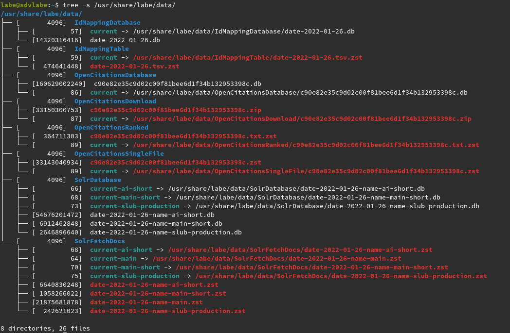

# Architecture

[Luigi](https://github.com/spotify/luigi) for orchestration (but trying to keep
[task code](https://github.com/slub/labe/blob/main/python/labe/tasks.py) small,
[cf. bl.uk](https://blogs.bl.uk/webarchive/2022/01/ukwa-2021-technical-update.html)).
Structured paths for data artifacts. Scheduling with
[cron](https://en.wikipedia.org/wiki/Cron).



Data acquisition and processing results in three (kinds of)
[sqlite3](https://sqlite.org/) databases:

* a) one id-doi "mapping" database
* b) one "citations" databases (doi-doi)
* c) one or more index "metadata" [fetcher](https://github.com/slub/labe/blob/838fdd6c935d9d2d18693ba6dd9625eb34accb7e/go/ckit/fetcher.go#L31-L34) (id-doc)

Currently, we use a
[FetchGroup](https://github.com/slub/labe/blob/838fdd6c935d9d2d18693ba6dd9625eb34accb7e/go/ckit/fetcher.go#L56-L62)
over multiple
[sqlite3](https://github.com/slub/labe/blob/838fdd6c935d9d2d18693ba6dd9625eb34accb7e/go/ckit/fetcher.go#L36-L40)
databases, but the [interface](https://github.com/slub/labe/blob/5f8dd0b14eb2293d84fa0e80c9d787f49366ed3f/go/ckit/fetcher.go#L31-L34) would allow to use a different local or remote backing stores.

A [server](https://github.com/slub/labe/blob/aa5cfc6c6dc99ecac8b3abe8b1402a25120a9a55/go/ckit/server.go#L45-L56)
assembles fused results from these databases on the fly (and caches expensive
requests) and builds JSON responses.

Cache warming can be a one-liner and can be run (in
[parallel](https://www.gnu.org/software/parallel/) and) in the background.

```shell
$ time zstdcat -T0 /usr/share/labe/data/OpenCitationsRanked/current | \
    awk '{print $2}' | \
    head -200000 | \
    shuf | \
    parallel -j 32 -I {} "curl -sL 'http://localhost:8000/doi/{}'" > /dev/null
```


This way we should get a good balance between a batch and on-the-fly approach:

* we need *little preprocessing*, we mostly turn CSV or SOLR JSON into sqlite databases
* we still can *be fast* through caching, which can be done forehandedly
  ("cache warming") or as data is actually requested; this is in essence the
  same work that would be needed in a batch approach, but we can do it lazily.

The server delivers JSON responses, which can be processed in catalog frontends.

```json
$ curl -sL "http://localhost:8000/doi/10.1016/s0273-1177(97)00070-7" | jq .
{
  "id": "ai-49-aHR0cDovL2R4LmRvaS5vcmcvMTAuMTAxNi9zMDI3My0xMTc3KDk3KTAwMDcwLTc",
  "doi": "10.1016/s0273-1177(97)00070-7",
  "cited": [
    {
      "author": [
        "Meljac, Claire",
        "Voyazopoulos, Robert"
      ],
      "doi_str_mv": [
        "10.4000/rechercheseducations.819"
      ],
      "format": [
        "ElectronicArticle"
      ],
      "id": "ai-49-aHR0cDovL2R4LmRvaS5vcmcvMTAuNDAwMC9yZWNoZXJjaGVzZWR1Y2F0aW9ucy44MTk",
      "institution": [
        "DE-Zi4",
        "DE-14",
        "DE-Ch1",
        "DE-Gla1",
        "DE-D161",
        "DE-Brt1",
        "DE-Pl11",
        "DE-Rs1",
        "DE-82",
        "DE-D275",
        "DE-15",
        "DE-105",
        "DE-L229",
        "DE-Bn3",
        "DE-Zwi2"
      ],
      "title": "Binet, citoyen indigne ?",
      "url": [
        "http://dx.doi.org/10.4000/rechercheseducations.819"
      ]
    }
  ],
  "unmatched": {},
  "extra": {
    "took": 0.001490343,
    "unmatched_citing_count": 0,
    "unmatched_cited_count": 0,
    "citing_count": 0,
    "cited_count": 1,
    "cached": false
  }
}
```
