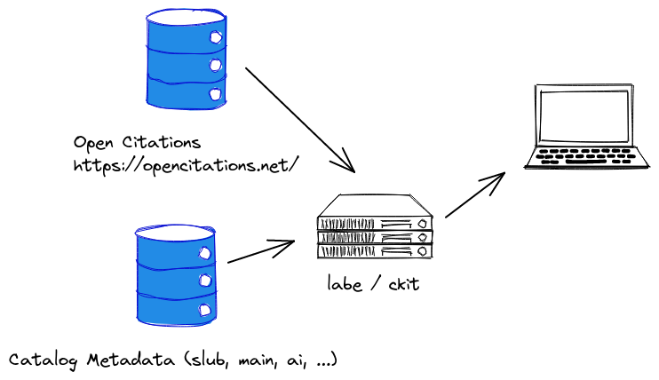

# LABE


Merging citations and catalog data at [SLUB Dresden](https://www.slub-dresden.de/).



> Status: testing

## Project

The project is composed of a couple of command line tools, both written in
Python and Go.

* [ckit](go/ckit), citation toolkit contains an API server, plus a few command line tools
* [python](python), orchestration helper to assemble data files regularly (based on luigi)

## Meeting Minutes

* [2022-02-03](notes/2022_02_03_meeting_minutes.md) (wrap-up)
* [2022-01-20](notes/2022_01_20_meeting_minutes.md)
* [2022-01-13](notes/2022_01_13_meeting_minutes.md)
* [2022-01-06](notes/2022_01_06_meeting_minutes.md)
* [2021-12-16](notes/2021_12_16_meeting_minutes.md)
* [2021-11-25](notes/2021_11_25_meeting_minutes.md)
* [2021-11-18](notes/2021_11_18_meeting_minutes.md)
* [2021-11-04](notes/2021_11_04_meeting_minutes.md)
* [2021-10-21](notes/2021_10_21_meeting_minutes.md)
* [2021-10-14](notes/2021_10_14_meeting_minutes.md)
* [2021-10-07](notes/2021_10_07_meeting_minutes.md)
* [2021-09-30](notes/2021_09_30_meeting_minutes.md)
* [2021-09-23](notes/2021_09_23_meeting_minutes.md)
* [2021-09-16](notes/2021_09_16_meeting_minutes.md)
* [2021-09-14](notes/2021_09_14_meeting_minutes.md) (kick-off)

## Project structure

```shell
$ tree -d
.
├── ansible
│   └── roles
│       ├── common
│       │   └── tasks
│       └── labe
│           ├── defaults
│           ├── tasks
│           └── templates
├── data
├── extra
│   └── perfstats
├── go
│   └── ckit
│       ├── cache
│       ├── cmd
│       │   ├── doisniffer
│       │   ├── labed
│       │   ├── makta
│       │   └── tabjson
│       ├── doi
│       ├── fixtures
│       ├── packaging
│       │   └── deb
│       │       └── ckit
│       │           └── DEBIAN
│       ├── set
│       ├── static
│       ├── tabutils
│       ├── testdata
│       └── xflag
├── notes
│   └── 2022_01_30_performance_report_files
├── python
│   ├── labe
│   ├── packaging
│   │   └── deb
│   │       └── labe
│   │           └── DEBIAN
│   └── tests
└── static

40 directories
```

## SLOC

```
$ tokei -C -t=Go,Python,yaml
===============================================================================
 Language            Files        Lines         Code     Comments       Blanks
===============================================================================
 Go                     19         2638         2114          335          189
 Python                 16         2557         2064          126          367
 YAML                    4          226          184           22           20
===============================================================================
 Total                  39         5421         4362          483          576
===============================================================================
```

## Ideas

* [x] stats on combined oci, refcat graph; [notes](notes/2022_02_08_stats_oci_refcat.md)
* [ ] stats on combined oci, [openalex](https://docs.openalex.org/download-snapshot/download-to-your-machine) (mag), refcat graph
* [ ] include "cited by" count in documents; may need a separate mapping
  database (with about 70M rows) for (doi, cited by count) -- could also be a
`COUNT` on oci, but may want to have separate lookup table for performance
(e.g. result would be just an int; db is about 4GB)

## Misc

> [A data web service](https://github.com/miku/dwstalk), lightning talk on the
> Go side of things at [Leipzig Gophers](https://golangleipzig.space/)
> 2021-11-23
