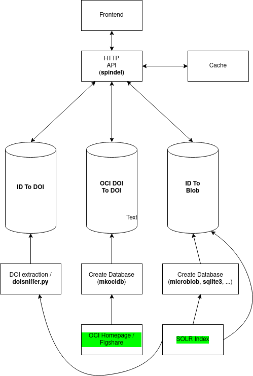

# Ideas on system design

Mix of ideas regarding system design, architecture.

## Unsorted

Raw inputs.

```
$ labe status
```

List downloaded files and possible updates. We need one directory locally, e.g.
under `XDG_DATA_HOME`, and subdirs for the various tasks. Directory should be
fully managed by the program, may contain a managed sqlite3 database recording
runs and actions (e.g. for delta, etc).

A separate folder for solr downloads; use script or
[solrdump](https://github.com/ubleipzig/solrdump).

Every task should be runnable separately, or at once with dependency
resolution.

```
$ labe-run SlubSolrExport
$ labe-run CociDownload
$ labe-run SlubFiltered
```

Other commands.

```
$ labe-status
$ labe-tree
```

Alternative third-party projects.

* [DVC](https://dvc.org/) for handling versions of the raw inputs and pipelines
* [taskfile.dev](https://taskfile.dev/#/)

## Some design issues

* [ ] we need SOLR data with DOI; might need external service to have best DOI
  coverage; how much is actually lost in the SOLR schema?
* [ ] one operation that applies an own data subset (e.g. by DOI) to open
  citations to produce a "local" version of citation links

Possible interaction, e.g. a sort of fusion:

```
$ ocifuse -oci coci.csv -our data.json -doi-field-name doi > fused.json
```

Take OCI and local file, output will be local file with additional fields for
inbound and outbound references, e.g. like (id refers to local id):

```json
{
    "id": "id-432",
    ...
    "citing": ["id-230", "id-123", ...],
    "cited": ["id-729", "id-192", ...],
    ...
}
```

This file should be servable per HTTP for catalog frontend or other systems.
May contain more information about the cited and citing entities (e.g. title,
authors, year, ...) to minimize additional requests. In fact: we want *only
one* request to get information about all linkage (inbound, outbound) - this
may be a few or a few thousand records. Opportinities for caching.

## Design proposal: Minimal Preprocessing

Core ideas: do not preprocess the data that much, but assemble result at request time.

An example implementation with [mkocidb](../tools/mkocidb/) and
[spindel](../tools/spindel/) works with three databases (could also be tables):

* local **id** to **doi** mapping (and vice versa) (12G)
* a copy of **doi-doi** edges from OCI corpus (155G)
* store of index data, accessibly by local **id** (256G)

In total currently 423G, might be more with bigger OCI dumps and extended index
cache.

Upsides of this approach:

* each dataset can be updated separetely, with minimal effort (replace (db) file and signal reload)
* less preprocessing complexity; we need OCI -> sqlite, index data -> sqlite
  and index data -> microblob (or something else); three operations; each of
  which could be independently replaced or optimized
* can adjust final output more easily, not reprocessing required

Challenges:

* live assembly needs to be performant

### A test run

Generate index for microblob from index data.

```
$ cd data
$ microblob -key id index.data
```

Run API server (spindel). Will need id mapping and oci dump sqlite databases.

```
$ cd tools/spindel
$ make
$ $ ./spindel -info | jq .
2021/09/23 12:31:45 ⚑ querying three data stores ...
{
  "identifier_database_count": 56879665,
  "oci_database_count": 1119201441,
  "index_data_count": 61529978
}
$ ./spindel

      ___           ___                     ___                         ___
     /\__\         /\  \                   /\  \         _____         /\__\
    /:/ _/_       /::\  \     ___          \:\  \       /::\  \       /:/ _/_
   /:/ /\  \     /:/\:\__\   /\__\          \:\  \     /:/\:\  \     /:/ /\__\
  /:/ /::\  \   /:/ /:/  /  /:/__/      _____\:\  \   /:/  \:\__\   /:/ /:/ _/_   ___     ___
 /:/_/:/\:\__\ /:/_/:/  /  /::\  \     /::::::::\__\ /:/__/ \:|__| /:/_/:/ /\__\ /\  \   /\__\
 \:\/:/ /:/  / \:\/:/  /   \/\:\  \__  \:\~~\~~\/__/ \:\  \ /:/  / \:\/:/ /:/  / \:\  \ /:/  /
  \::/ /:/  /   \::/__/     ~~\:\/\__\  \:\  \        \:\  /:/  /   \::/_/:/  /   \:\  /:/  /
   \/_/:/  /     \:\  \        \::/  /   \:\  \        \:\/:/  /     \:\/:/  /     \:\/:/  /
     /:/  /       \:\__\       /:/  /     \:\__\        \::/  /       \::/  /       \::/  /
     \/__/         \/__/       \/__/       \/__/         \/__/         \/__/         \/__/

spindel is an experimental api server for labe; it works with three databases:

* an sqlite3 catalog id to doi translation table (11GB)
* an sqlite3 version of OCI (145GB)
* a key-value store mapping catalog ids to catalog entities (239GB)

Each database may be updated separately, with separate processes; e.g.
currently we use the experimental mkocidb command turn (k, v) TSV files into
sqlite3 lookup databases.

Examples:

http://localhost:3000/q/ai-49-aHR0cDovL2R4LmRvaS5vcmcvMTAuMTAwNi9qbXJlLjE5OTkuMTcxNQ
http://localhost:3000/q/ai-49-aHR0cDovL2R4LmRvaS5vcmcvMTAuMTAwMS9qYW1hLjI4Mi4xNi4xNTE5

2021/09/23 12:32:51 spindel starting 2a8ad6c 2021-09-23T10:09:28Z http://localhost:3000
```

Now query the API.

```
$ curl -s http://localhost:3000/q/ai-49-aHR0cDovL2R4LmRvaS5vcmcvMTAuMTAwNi9qbXJlLjE5OTkuMTcxNQ | jq . | head
{
  "id": "ai-49-aHR0cDovL2R4LmRvaS5vcmcvMTAuMTAwNi9qbXJlLjE5OTkuMTcxNQ",
  "doi": "10.1006/jmre.1999.1715",
  "citing": [
    {
      "access_facet": "Electronic Resources",
      "author_facet": [
        "Parella, Teodor"
      ],
      "author": [

$ curl -s http://localhost:3000/q/ai-49-aHR0cDovL2R4LmRvaS5vcmcvMTAuMTAwNi9qbXJlLjE5OTkuMTcxNQ | jq -r .extra
{
  "took": 0.015427289,
  "citing_count": 15,
  "cited_count": 8
}

$ curl -s http://localhost:3000/q/ai-49-aHR0cDovL2R4LmRvaS5vcmcvMTAuMTAwNi9qbXJlLjE5OTkuMTcxNQ | jq -rc '[.id, .doi, .extra.citing_count, .extra.cited_count, .extra.took] | @tsv'
ai-49-aHR0cDovL2R4LmRvaS5vcmcvMTAuMTAwNi9qbXJlLjE5OTkuMTcxNQ    10.1006/jmre.1999.1715  15      8       0.014582883
```

Run against a list of ids.

```
$ cat fixtures/100K.ids | parallel -j 40 "curl -s http://localhost:3000/q/{}" | \
    jq -rc '[.id, .doi, .extra.citing_count, .extra.cited_count, .extra.took] | @tsv' | \
    head -20 | column -t
ai-49-aHR0cDovL2R4LmRvaS5vcmcvMTAuMTAwNy9iZjAyNTQwMjU2                  10.1007/bf02540256                 4   4   0.00480615
ai-49-aHR0cDovL2R4LmRvaS5vcmcvMTAuMTAyMS9hYzYwMDc5YTAzNQ                10.1021/ac60079a035                0   1   0.001927677
ai-49-aHR0cDovL2R4LmRvaS5vcmcvMTAuMTEwMy9waHlzcmV2Yy40OS4zMDYx          10.1103/physrevc.49.3061           27  4   0.012922296
ai-49-aHR0cDovL2R4LmRvaS5vcmcvMTAuMTAwNy85NzgtMy02NDItNDE5MTQtMF8xMA    10.1007/978-3-642-41914-0_10       0   2   0.001318506
ai-49-aHR0cDovL2R4LmRvaS5vcmcvMTAuMTA4OC8xNzQyLTY1OTYvMjc5LzEvMDEyMDI5  10.1088/1742-6596/279/1/012029     0   2   0.001373411
ai-49-aHR0cDovL2R4LmRvaS5vcmcvMTAuMTE3Ny8xNzQ3MDE2MTA2MDAyMDA0MTE       10.1177/174701610600200411         1   0   0.002660606
ai-49-aHR0cDovL2R4LmRvaS5vcmcvMTAuMTA4OC8xNzU3LTg5OXgvNzY4LzUvMDUyMTA1  10.1088/1757-899x/768/5/052105     2   0   0.001126009
ai-49-aHR0cDovL2R4LmRvaS5vcmcvMTAuMTA3MC9xZWwxNjE0Ng                    10.1070/qel16146                   0   2   0.001184095
ai-49-aHR0cDovL2R4LmRvaS5vcmcvMTAuMTEzNC9zMTk5NTA4MDIyMDA5MDA1eA        10.1134/s199508022009005x          3   0   0.001468909
ai-49-aHR0cDovL2R4LmRvaS5vcmcvMTAuMTAxNi9zMDE0MC02NzM2KDU2KTkxNTU5LTg   10.1016/s0140-6736(56)91559-8      2   5   0.002676469
ai-49-aHR0cDovL2R4LmRvaS5vcmcvMTAuMTA1NS9zLTIwMDctOTk5NDgx              10.1055/s-2007-999481              0   2   0.005652482
ai-49-aHR0cDovL2R4LmRvaS5vcmcvMTAuMTAyMS9pYzAwMDk3YTAwOA                10.1021/ic00097a008                0   18  0.008501782
ai-49-aHR0cDovL2R4LmRvaS5vcmcvMTAuMTE3Ny8wNDg2NjEzNDk4MDMwMDA0MDc       10.1177/048661349803000407         1   1   0.001450654
ai-49-aHR0cDovL2R4LmRvaS5vcmcvMTAuMTA4OC8wMzA1LTQ0NzAvMjIvMTQvMDE3      10.1088/0305-4470/22/14/017        6   2   0.003810797
ai-49-aHR0cDovL2R4LmRvaS5vcmcvMTAuMTE0NS8zNTcxMjEuMzU3MTI1              10.1145/357121.357125              2   5   0.003001458
ai-49-aHR0cDovL2R4LmRvaS5vcmcvMTAuNzMxNi9raG5lcy4yMDE0LjI1LjMuMjQw      10.7316/khnes.2014.25.3.240        1   0   0.001066351
ai-85-MTAuMTAxNi9qLmRydWdhbGNkZXAuMjAxNS4wNy4xMDAz                      10.1016/j.drugalcdep.2015.07.1003  0   0   0.000383586
ai-49-aHR0cDovL2R4LmRvaS5vcmcvMTAuMTAxNi8wMzc1LTk0NzQoODIpOTAyNDctMA    10.1016/0375-9474(82)90247-0       17  58  0.029145293
ai-49-aHR0cDovL2R4LmRvaS5vcmcvMTAuMTM1My9sYW4uMjAxMi4wMDQ5              10.1353/lan.2012.0049              0   17  0.00781124
ai-49-aHR0cDovL2R4LmRvaS5vcmcvMTAuMTM3MS9qb3VybmFsLnBvbmUuMDE4MTI4Mw    10.1371/journal.pone.0181283       1   0   0.001160138
```

Another run.


```
$ time shuf -n 10000 fixtures/100K.ids | \
    parallel -j 40 "curl -s http://localhost:3000/q/{}" | \
    jq -rc '[.id, .doi, .extra.citing_count, .extra.cited_count, .extra.took] | @tsv' | \
    column -t > fixtures/10K.tsv

real    0m59.424s
user    1m53.256s
sys     1m23.730s

$ grep -v ^ai fixtures/10K.tsv | column -t | head -30
finc-39-rfp055678071990num9011396     10.3406/rfp.1990.1396              0   2   0.003799668
0-164732985X                          10.1007/b138439                    0   3   0.008817667
finc-30-70385                         10.17645/si.v8i4.2971              0   1   0.001594432
finc-39-iliri172725481989num1921964   10.3406/iliri.1989.1964            0   1   0.0019337
0-78233671X                           10.14361/transcript.9783839414613  0   0   0.000361578
0-1653867825                          10.1007/978-3-662-47727-4          0   4   0.006545916
finc-39-psy000350331909num1613791     10.3406/psy.1909.3791              0   0   0.004344172
0-1751704238                          10.3390/medicina56070333           52  0   0.055046509
finc-39-lgge0458726X1997num311251772  10.3406/lgge.1997.1772             0   2   0.003749232
0-1671451538                          10.3390/rel10060377                14  1   0.013443044
0-168179635X                          10.1007/s10273-019-2471-3          3   0   0.003644457
0-1649321856                          10.1007/3-540-60640-8              0   8   0.016807675
finc-39-roma003580291969num903602717  10.3406/roma.1969.2717             0   1   0.002175562
0-1046668277                          10.3386/w13730                     0   2   0.003325452
0-1756679533                          10.32479/ijeep.9784                0   1   0.001695846
finc-52-50cf737fen                    10.1787/50cf737f-en                0   0   0.000805597
finc-39-linly036613261935num459049    10.3406/linly.1935.9049            0   0   0.000701992
finc-39-estat033614542008num41917728  10.3406/estat.2008.7728            0   1   0.002312015
26-46762                              10.7476/9788599662618              0   3   0.003442961
finc-39-roman004885931982num12354540  10.3406/roman.1982.4540            0   1   0.001560529
0-1656979373                          10.1007/978-3-658-10109-1          0   1   0.002038243
finc-39-abpo0003391X1948num5511862    10.3406/abpo.1948.1862             0   1   0.00262545
0-1657395383                          10.4018/978-1-5225-0539-6          0   0   0.001020225
0-640981216                           10.1515/9783110211733              0   0   0.00129707
0-1576781976                          10.18632/oncotarget.21249          13  4   0.02069308
finc-39-pop003246631985num40617566    10.2307/1532781                    0   2   0.002260609
finc-39-crai006505362012num156193402  10.3406/crai.2012.93402            0   0   0.000764846
0-1694057674                          10.1007/978-981-15-0263-7          0   0   0.001798439
0-1046756516                          10.3386/w5179                      0   1   0.001577239
finc-39-estat033614541998num31612647  10.3406/estat.1998.2647            0   5   0.006353544
```

### Index data access abstraction

We can abstract the index data (blob) access, e.g. like:

```go
// Fetcher fetches one or more blobs given their identifiers.
type Fetcher interface {
	Fetch(id string) ([]byte, error)
	FetchSet(ids ...string) ([][]byte, error)
}
```

Turning an identifier (or multiple ids) into blobs. We currently have:

* microblob
* sqlite3 (w/o compression)
* solr

Helper to turn solr data dump into SQL ingestable tabular form,
[tabbedjson](https://github.com/GROSSWEBER/labe/tree/main/tools/tabbedjson)
(supports a form of compression).

Next abstraction would be to turn a path into a data source name and allow
mysql, pg, sqlite. The mkocidb tool would need to be adapted (e.g. `LOAD DATA
LOW_PRIORITY LOCAL INFILE ...` for mysql, etc).

Make `mkocidb` a slightly more generic tool, e.g. "turn any TSV into a lookup
database" with various adapters and performance tweaks; possible names:
`mkkvs`, `tabkvs`, `tabtokvs`, ...

### Multiple data stores

We could support multiple databases, e.g. a query goes to each of the data
stores and results get fused, e.g. we could have two sources for OCI and
refcat. Again, each with independent update cycles.

### A diagram


