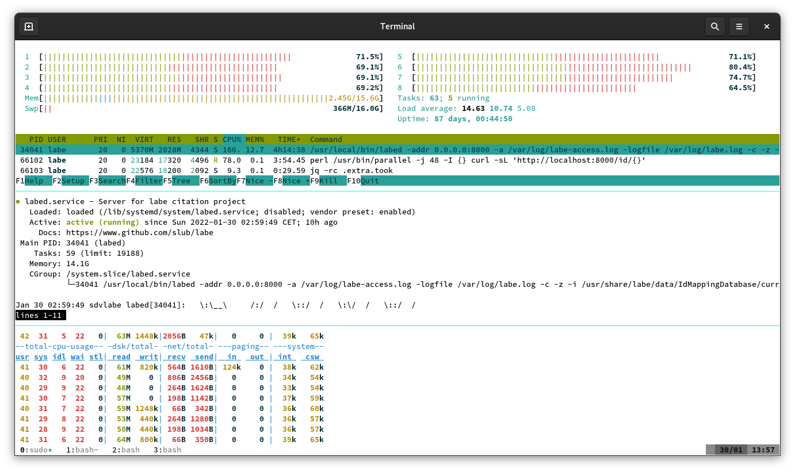

# Performance Report

> 2022-01-30

```
$ neofetch

       _,met$$$$$gg.          hey@sdvlabe
    ,g$$$$$$$$$$$$$$$P.       --------------
  ,g$$P"     """Y$$.".        OS: Debian GNU/Linux 10 (buster) x86_64
 ,$$P'              `$$$.     Host: VMware Virtual Platform None
',$$P       ,ggs.     `$$b:   Kernel: 4.19.0-18-amd64
`d$$'     ,$P"'   .    $$$    Uptime: 87 days, 55 mins
 $$P      d$'     ,    $$P    Packages: 469 (dpkg)
 $$:      $$.   -    ,d$$'    Shell: bash 5.0.3
 $$;      Y$b._   _,d$P'      Terminal: /dev/pts/0
 Y$$.    `.`"Y$$$$P"'         CPU: Intel Xeon Gold 5218 (8) @ 2.294GHz
 `$$b      "-.__              GPU: VMware SVGA II Adapter
  `Y$$                        Memory: 2523MiB / 16019MiB
   `Y$$.
     `$$b.
       `Y$$b.
          `"Y$b._
              `"""

$ labed -version
labed 88397c6 2022-01-30T01:03:12Z
```

Random ids are chosen from ~72M possible ids that have a map to a DOI (this
does not mean, that it has a relation in the citations database).

```
$ zstdcat -T0 /usr/share/labe/data/IdMappingTable/current | wc -l
72731297
```

The number of cached items in subsequent tests may be slightly bigger (as
additional items have been cached).

Format:

* number of local ids
* number of cached items
* parallel requests
* filter (y/n)

## Overview

* [10K / 150K / 32 / n](https://github.com/slub/labe/blob/main/notes/2022_01_30_performance_report.md#10k--150k--32--n)
* [10K / 150K / 32 / y](https://github.com/slub/labe/blob/main/notes/2022_01_30_performance_report.md#10k--150k--32--y)
* [10K / 0K / 32 / y](https://github.com/slub/labe/blob/main/notes/2022_01_30_performance_report.md#10k--0k--32--y)
* [100K / 150K / 16 / n](https://github.com/slub/labe/blob/main/notes/2022_01_30_performance_report.md#100k--150k--16--n)
* [100K / 150K / 48 / n](https://github.com/slub/labe/blob/main/notes/2022_01_30_performance_report.md#100k--150k--48--n)
* [1K / 0K / 32 / n](https://github.com/slub/labe/blob/main/notes/2022_01_30_performance_report.md#1k--0k--32--n)
* [1K / 1K / 32 / n](https://github.com/slub/labe/blob/main/notes/2022_01_30_performance_report.md#1k--1k--32--n)
* [100K / 200K / 32 / n](https://github.com/slub/labe/blob/main/notes/2022_01_30_performance_report.md#100k--200k--32--n)
* [100K / 200K / 16 / n](https://github.com/slub/labe/blob/main/notes/2022_01_30_performance_report.md#100k--200k--16--n)
* [100K / 200K / 8 / n](https://github.com/slub/labe/blob/main/notes/2022_01_30_performance_report.md#100k--200k--8--n)
* [10K / 200K / 2 / n](https://github.com/slub/labe/blob/main/notes/2022_01_30_performance_report.md#10k--200k--2--n)
* [100K / 250K / 8 / n](https://github.com/slub/labe/blob/main/notes/2022_01_30_performance_report.md#100k--250k--8--n)
* [25K / 250K / 1 / n](https://github.com/slub/labe/blob/main/notes/2022_01_30_performance_report.md#25k--250k--1--n)

----

## 10K / 150K / 32 / n

```
$ time zstdcat -T0 /usr/share/labe/data/IdMappingTable/current | \
    awk '{print $1}' | shuf -n 10000 | \
    parallel -j 32 -I {} "curl -sL 'http://localhost:8000/id/{}'" | \
    jq -rc .extra.took > 10_150_32_n.tsv

real    0m57.044s
user    1m51.982s
sys     1m10.747s
```

> Results

```
count   6026.0
mean    0.069525608822768
std     0.13572305001969948
min     0.001951155
25%     0.01611085775
50%     0.0373924795
75%     0.06952258375
95%     0.2035256885
99%     0.73334005
99.5%   1.0769603348749999
99.9%   1.4530845264750059
99.99%  1.5616499532224175
100%    1.618536359
max     1.618536359
```

## 10K / 150K / 32 / y

```
$ time zstdcat -T0 /usr/share/labe/data/IdMappingTable/current | \
    awk '{print $1}' | shuf -n 10000 | \
    parallel -j 32 -I {} "curl -sL 'http://localhost:8000/id/{}?i=DE-14'" | \
    jq -rc .extra.took > 10_150_32_y.tsv

real    0m58.236s
user    1m54.580s
sys     1m12.651s
```

> Results

```
count   5999.0
mean    0.052833624121353555
std     0.0853497560623813
min     0.000430559
25%     0.013456665
50%     0.030074125
75%     0.0572592625
95%     0.16796195829999996
99%     0.4916874135799958
99.5%   0.6395566931400012
99.9%   0.7722342863040145
99.99%  1.1777203690489761
100%    1.194194023
max     1.194194023
```

## 10K / 0K / 32 / y

```
$ time zstdcat -T0 /usr/share/labe/data/IdMappingTable/current | \
    awk '{print $1}' | shuf -n 10000 | \
    parallel -j 32 -I {} "curl -sL 'http://localhost:8000/id/{}?i=DE-14'" | \
    jq -rc .extra.took > 10_0_32_y.tsv

real    1m1.063s
user    1m55.704s
sys     1m14.717s
```

> Results

```
count   5934.0
mean    0.056262994630940345
std     0.12733204352559316
min     0.000321107
25%     0.01340504
50%     0.030664055
75%     0.059697361500000004
95%     0.1814729362999997
99%     0.4465643534600002
99.5%   0.5551913802450005
99.9%   1.2522033721130827
99.99%  3.936755166209296
100%    6.686145303
max     6.686145303
```

## 100K / 150K / 16 / n

```
$ time zstdcat -T0 /usr/share/labe/data/IdMappingTable/current | \
    awk '{print $1}' | shuf -n 100000 | \
    parallel -j 16 -I {} "curl -sL 'http://localhost:8000/id/{}'" | \
    jq -rc .extra.took > 100_150_16_n.tsv

real    6m14.384s
user    13m12.131s
sys     9m42.016s
```

> Results

```
count   59746.0
mean    0.049754040905165206
std     0.09418759928968966
min     0.000474105
25%     0.0125099175
50%     0.029008653000000002
75%     0.055278471
95%     0.148788049
99%     0.39075252255000054
99.5%   0.5369267160250015
99.9%   1.2946787526800094
99.99%  2.522602559548393
100%    4.5396280860000005
max     4.5396280860000005
```

## 100K / 150K / 48 / n

```
$ time zstdcat -T0 /usr/share/labe/data/IdMappingTable/current | \
    awk '{print $1}' | shuf -n 100000 | \
    parallel -j 48 -I {} "curl -sL 'http://localhost:8000/id/{}'" | \
    jq -rc .extra.took > 100_150_48_n.tsv

real    6m13.058s
user    13m25.169s
sys     10m2.076s
```



> Results

```
count   59400.0
mean    0.059010946614276104
std     0.1174613430670048
min     0.000107
25%     0.013895456
50%     0.031852294
75%     0.0616479725
95%     0.18499460749999985
99%     0.5130498874900006
99.5%   0.780213243339988
99.9%   1.414341842967231
99.99%  2.0529509573230866
100%    7.522301854
max     7.522301854
```

## 1K / 0K / 32 / n

* top most expensive docs, plus redirect

```
$ time zstdcat -T0 /usr/share/labe/data/OpenCitationsRanked/current | \
    awk '{print $2}' | head -n 1000 | \
    parallel -j 32 -I {} "curl -sL 'http://localhost:8000/doi/{}'" | \
    jq -rc .extra.took > 1_0_32_n.tsv

real    6m5.641s
user    1m44.343s
sys     0m22.553s
```

> Results

```
count   661.0
mean    17.07446426031316
std     12.36869567471186
min     4.292194971
25%     10.47658709
50%     13.174479671
75%     18.149221195
95%     45.129916904
99%     60.84711251679998
99.5%   69.00280557950008
99.9%   101.66116247292209
99.99%  140.58392134518996
100%    144.908672331
max     144.908672331
```

## 1K / 1K / 32 / n

* top most expensive docs, plus redirect; all items cached

```
$ time zstdcat -T0 /usr/share/labe/data/OpenCitationsRanked/current | \
    awk '{print $2}' | head -n 1000 | \
    parallel -j 32 -I {} "curl -sL 'http://localhost:8000/doi/{}'" | \
    jq -rc .extra.took > 1_1_32_n.tsv

real    1m20.448s
user    1m27.920s
sys     0m22.211s
```

Note, that for the "real" reading, the bottleneck is `jq` - those documents are
quite big. The total bytes sent in this case is over 3GB.

> Results

```
count   661.0
mean    0.02209813767019667
std     0.06960397052862143
min     0.000658
25%     0.001978
50%     0.004339
75%     0.007261
95%     0.150513
99%     0.36790879999999954
99.5%   0.41653480000000054
99.9%   0.5681860200000074
99.99%  0.7060552019999928
100%    0.721374
max     0.721374
```

## 100K / 200K / 32 / n

```
$ time zstdcat -T0 /usr/share/labe/data/IdMappingTable/current | \
    awk '{print $1}' | shuf -n 100000 | \
    parallel -j 32 -I {} "curl -sL 'http://localhost:8000/id/{}'" | \
    jq -rc .extra.took > 100_200_32_n.tsv

real    6m16.495s
user    13m44.408s
sys     9m58.037s
```

> Results

```
count   59737.0
mean    0.05532090641736277
std     0.10440201029001707
min     0.000249
25%     0.013934712
50%     0.031817175
75%     0.0605167
95%     0.16639817
99%     0.42079971239999975
99.5%   0.6734620138799999
99.9%   1.379923397320045
99.99%  1.8354236451565984
100%    5.056811688
max     5.056811688
```

In words: 99.5% of requests are answered in less than 670 ms.

## 100K / 200K / 16 / n

```
$ time zstdcat -T0 /usr/share/labe/data/IdMappingTable/current | \
    awk '{print $1}' | shuf -n 100000 | \
    parallel -j 16 -I {} "curl -sL 'http://localhost:8000/id/{}'" | \
    jq -rc .extra.took > 100_200_32_n.tsv

real    6m3.838s
user    13m24.944s
sys     9m34.430s
```

> Results

```
count   59811.0
mean    0.04729659819080102
std     0.08968581700254126
min     0.000283073
25%     0.0120395895
50%     0.027985846
75%     0.0531296815
95%     0.14187775149999998
99%     0.35084227190000117
99.5%   0.49099134694999996
99.9%   1.1225115812200386
99.99%  1.5513531715020963
100%    8.153026578
max     8.153026578
```

In words: 99.5% of requests are answered in less than 490 ms.

## 100K / 200K / 8 / n

```
$ time zstdcat -T0 /usr/share/labe/data/IdMappingTable/current | \
    awk '{print $1}' | shuf -n 100000 | \
    parallel -j 8 -I {} "curl -sL 'http://localhost:8000/id/{}'" | \
    jq -rc .extra.took > 100_200_32_n.tsv

real    8m36.202s
user    13m3.800s
sys     9m3.214s
```

> Results

```
count   59720.0
mean    0.041847604683104486
std     0.07908671543896699
min     0.000118
25%     0.01072277375
50%     0.0247479445
75%     0.0472173865
95%     0.12424948984999996
99%     0.30989023608999944
99.5%   0.4216174154949996
99.9%   1.0876998167700243
99.99%  2.411902293074092
100%    5.277846136
max     5.277846136
```

In words: 99.5% of requests are answered in less than 420 ms.


## 10K / 200K / 2 / n

```
$ time zstdcat -T0 /usr/share/labe/data/IdMappingTable/current | \
    awk '{print $1}' | shuf -n 10000 | \
    parallel -j 2 -I {} "curl -sL 'http://localhost:8000/id/{}'" | \
    jq -rc .extra.took > 10_200_2_n.tsv

real    3m6.210s
user    1m47.824s
sys     1m6.662s
```

> Results

```
count   5887.0
mean    0.03478853753762527
std     0.06672989485764204
min     0.000417784
25%     0.0088731305
50%     0.020669452
75%     0.0394999735
95%     0.10146272789999998
99%     0.2411704568000015
99.5%   0.3334799537999991
99.9%   0.8952749625080068
99.99%  1.8832478243112134
100%    2.12236816
max     2.12236816
```

In words: 99.5% of requests are answered in less than 333 ms.


## 100K / 250K / 8 / n

```
$ time zstdcat -T0 /usr/share/labe/data/IdMappingTable/current | \
    awk '{print $1}' | shuf -n 100000 | \
    parallel -j 8 -I {} "curl -sL 'http://localhost:8000/id/{}'" | \
    jq -rc .extra.took > 100_250_8_n.tsv

real    12m6.887s
user    15m3.460s
sys     10m28.117s
```

> Results

```
count   59515.0
mean    0.06580645975290264
std     0.10183488559427872
min     0.000315747
25%     0.017783385999999998
50%     0.040821632
75%     0.0774112315
95%     0.19960330019999997
99%     0.44929262388000024
99.5%   0.6034766201400004
99.9%   1.210110393076014
99.99%  1.5660877300677754
100%    8.127795763
max     8.127795763
```

In words: 99.5% of requests are answered in less than 603 ms.

## 25K / 250K / 1 / n

```
$ time zstdcat -T0 /usr/share/labe/data/IdMappingTable/current | \
    awk '{print $1}' | shuf -n 25000 | \
    parallel -j 1 -I {} "curl -sL 'http://localhost:8000/id/{}'" | \
    jq -rc .extra.took > 25_250_1_n.tsv

real    18m23.141s
user    3m54.353s
sys     2m38.193s
```

> Results

```
count   14980.0
mean    0.04917455059038718
std     0.08558642182488191
min     0.000936693
25%     0.01319285075
50%     0.0295086135
75%     0.05611835275
95%     0.14694397039999998
99%     0.35172001466999614
99.5%   0.4664901235249996
99.9%   1.2225485266271958
99.99%  1.727230540032094
100%    3.503685577
max     3.503685577
```

In words: 99.5% of requests are answered in less than 466 ms.

