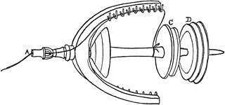

# Spindel



Experimental API server, takes requests for a given id and returns a
result fused from OCI citations and index data.

```
ai-49-aHR0cD...TAuMTEwNC9wc...    10.1104/pp.88.4.1411           0   33   0.011371553
ai-49-aHR0cD...TAuMTc1NzYva...    10.17576/jsm-2019-4808-23      0   3    0.002403981
ai-49-aHR0cD...TAuMTYxNC93d...    10.1614/wt-08-045.1            19  12   0.006658463
ai-49-aHR0cD...TAuMzg5Ny96b...    10.3897/zookeys.449.6813       0   1    0.000609854
ai-49-aHR0cD...TAuMTA4OC8xN...    10.1088/1757-899x/768/5/052105 2   0    0.000913447
ai-49-aHR0cD...TAuNTgxMS9jc...    10.5811/cpcem.2019.7.43632     1   0    0.047257667
ai-49-aHR0cD...TAuMTEwMy9wa...    10.1103/physrevc.49.3061       27  4    0.008262996
ai-49-aHR0cD...TAuMTM3MS9qb...    10.1371/journal.pone.0077786   38  15   0.018779194
ai-49-aHR0cD...TAuMTAwMi9sZ...    10.1002/ldr.3400040418         2   0    0.000982242
ai-49-aHR0cD...TAuMTEwMy9wa...    10.1103/physrevlett.81.3187    15  14   0.007743473
ai-49-aHR0cD...TAuMTAwMi9ub...    10.1002/nme.1620300822         7   6    0.004755116
ai-49-aHR0cD...TAuMTM3MS9qb...    10.1371/journal.pcbi.1002234   54  4    0.018582831
ai-49-aHR0cD...TAuMTAxNi8wM...    10.1016/0165-4896(94)00731-4   5   4    0.004127696
ai-49-aHR0cD...TAuMTA5My9qe...    10.1093/jxb/49.318.21          0   0    0.000267756
ai-49-aHR0cD...TAuMTE0Mi9zM...    10.1142/s0218126619500051      22  2    0.006445901
ai-49-aHR0cD...TAuNzg2MS9jb...    10.7861/clinmedicine.17-4-332  13  8    0.005840636
ai-49-aHR0cD...TAuMTM3My9jb...    10.1373/clinchem.2013.204446   20  11   0.011903923
ai-49-aHR0cD...TAuMTE0My9qa...    10.1143/jjap.9.958             0   7    0.002963267
ai-49-aHR0cD...TAuMTAyMS9hb...    10.1021/am8001605              29  64   0.022973696
ai-49-aHR0cD...TAuMTIwNy9zM...    10.1207/s15326934crj1401_1     0   21   0.056867545
```

## Usage

```sh
$ spindel -h
usage: spindel [-I FILE] [-O FILE] [-bs URL] [-Q FILE] [-S URL] [-l ADDR] [-version]

spindel is an experimental api server for labe; it works with three data stores.

* (1) an sqlite3 catalog id to doi translation table (11GB)
* (2) an sqlite3 version of OCI (145GB)
* (3) a key-value store mapping catalog ids to catalog entities (two
      implementations: 256GB microblob, 353GB sqlite3)

Each database may be updated separately, with separate processes; e.g.
currently we use the experimental mkocidb command turn (k, v) TSV files into
sqlite3 lookup databases.

Examples

- http://localhost:3000/id/ai-49-aHR0cDovL2R4LmRvaS5vcmcvMTAuMTA3My9wbmFzLjg1LjguMjQ0NA
- http://localhost:3000/id/ai-49-aHR0cDovL2R4LmRvaS5vcmcvMTAuMTAwMS9qYW1hLjI4Mi4xNi4xNTE5
- http://localhost:3000/id/ai-49-aHR0cDovL2R4LmRvaS5vcmcvMTAuMTAwNi9qbXJlLjE5OTkuMTcxNQ
- http://localhost:3000/id/ai-49-aHR0cDovL2R4LmRvaS5vcmcvMTAuMTE3Ny8xMDQ5NzMyMzA1Mjc2Njg3
- http://localhost:3000/id/ai-49-aHR0cDovL2R4LmRvaS5vcmcvMTAuMTIxMC9qYy4yMDExLTAzODU
- http://localhost:3000/id/ai-49-aHR0cDovL2R4LmRvaS5vcmcvMTAuMTIxNC9hb3MvMTE3NjM0Nzk2Mw
- http://localhost:3000/id/ai-49-aHR0cDovL2R4LmRvaS5vcmcvMTAuMjMwNy8yMDk1NTIx

Bulk requests

    $ curl -sL https://git.io/JzVmJ |
    parallel -j 40 "curl -s http://localhost:3000/id/{}" |
    jq -rc '[.id, .doi, .extra.citing_count, .extra.cited_count, .extra.took] | @tsv'

Flags

  -I string
        identifier database path (default "i.db")
  -L    enable logging
  -O string
        oci as a datbase path (default "o.db")
  -Q string
        sqlite3 blob index path
  -S string
        solr blob URL
  -W    enable stopwatch
  -bs string
        blob server URL
  -g    enable gzip compression
  -l string
        host and port to listen on (default "localhost:3000")
  -version
        show version
```

## Fetch or FetchMany

There seems to be not that much difference between one expensive `IN` and many
cheap SQL queries in case of sqlite3.

```python
In [13]: df.took.describe() # SELECT .. WHERE k = ...
Out[13]:
count    64860.000000
mean         0.015844
std          0.038631
min          0.000371
25%          0.003467
50%          0.008700
75%          0.018176
max          6.080011
Name: took, dtype: float64

In [14]: dfin.took.describe() # SELECT .. IN ...
Out[14]:
count    64860.000000
mean         0.016218
std          0.038260
min          0.000321
25%          0.003560
50%          0.008910
75%          0.018594
max          5.718692
Name: took, dtype: float64

```

## Using a stopwatch

Experimental `-W` flag to trace duration of various operations.

```sh
$ spindel -W -bs http://localhost:8820


   _|_|_|            _|                  _|            _|
 _|        _|_|_|        _|_|_|      _|_|_|    _|_|    _|
   _|_|    _|    _|  _|  _|    _|  _|    _|  _|_|_|_|  _|
       _|  _|    _|  _|  _|    _|  _|    _|  _|        _|
 _|_|_|    _|_|_|    _|  _|    _|    _|_|_|    _|_|_|  _|
           _|
           _|

Examples

- http://localhost:3000/id/ai-49-aHR0cDovL2R4LmRvaS5vcmcvMTAuMTA3My9wbmFzLjg1LjguMjQ0NA
- http://localhost:3000/id/ai-49-aHR0cDovL2R4LmRvaS5vcmcvMTAuMTAwMS9qYW1hLjI4Mi4xNi4xNTE5
- http://localhost:3000/id/ai-49-aHR0cDovL2R4LmRvaS5vcmcvMTAuMTAwNi9qbXJlLjE5OTkuMTcxNQ
- http://localhost:3000/id/ai-49-aHR0cDovL2R4LmRvaS5vcmcvMTAuMTE3Ny8xMDQ5NzMyMzA1Mjc2Njg3
- http://localhost:3000/id/ai-49-aHR0cDovL2R4LmRvaS5vcmcvMTAuMTIxMC9qYy4yMDExLTAzODU
- http://localhost:3000/id/ai-49-aHR0cDovL2R4LmRvaS5vcmcvMTAuMTIxNC9hb3MvMTE3NjM0Nzk2Mw
- http://localhost:3000/id/ai-49-aHR0cDovL2R4LmRvaS5vcmcvMTAuMjMwNy8yMDk1NTIx

2021/09/29 17:35:19 spindel starting 3870a68 2021-09-29T15:34:00Z http://localhost:3000
2021/09/29 17:35:20 timings for XVlB

> XVlB    0    0s             0.00    started query for: ai-49-aHR0cDovL2R4LmRvaS5vcmcvMTAuMTA5OC9yc3BhLjE5OTguMDE2NA
> XVlB    1    397.191µs      0.00    found doi for id: 10.1098/rspa.1998.0164
> XVlB    2    481.676µs      0.01    found 8 citing items
> XVlB    3    18.984627ms    0.23    found 456 cited items
> XVlB    4    13.421306ms    0.16    mapped 464 dois back to ids
> XVlB    5    494.163µs      0.01    recorded unmatched ids
> XVlB    6    44.093361ms    0.52    fetched 302 blob from index data store
> XVlB    7    6.422462ms     0.08    encoded JSON
> XVlB    -    -              -       -
> XVlB    S    84.294786ms    1.0     total
```

